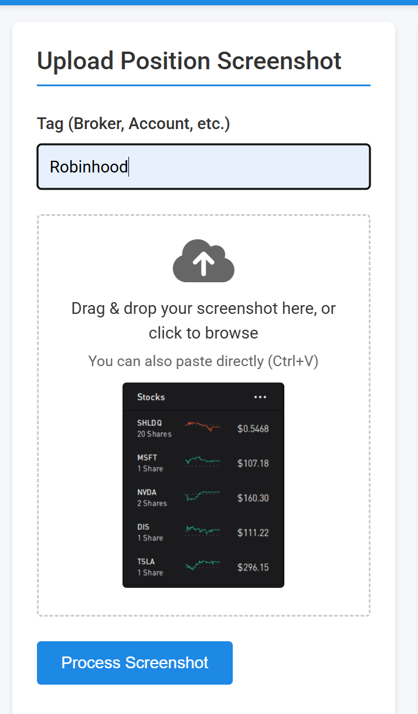
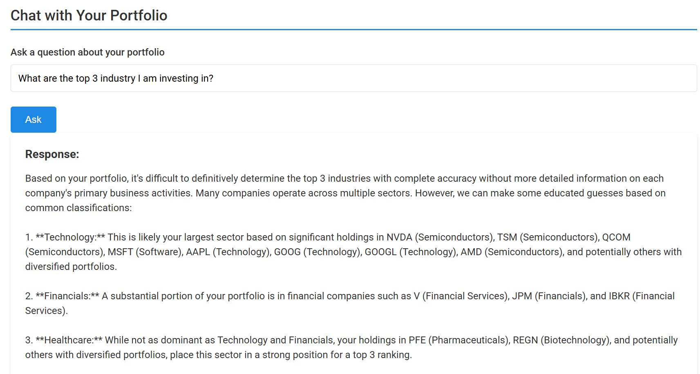

# ChatWallStreet - AI-Powered Portfolio Tracker

A modern web application that uses AI to help you track and analyze your stock portfolio from screenshots. Upload images of your positions, let AI extract the data, and get insights about your investments—all without complex setup or databases.

**Note: All stock data shown in the demo images are for testing purposes only.**

## Features

- **AI-Powered Position Extraction**: Upload screenshots of your portfolio and let AI extract stock positions automatically
- **Multiple Portfolio Support**: Organize positions by broker, account type, or custom tags
- **Real-Time Price Updates**: Get current market values using free stock price APIs
- **Smart Filtering**: Group positions by symbol or filter by tags
- **AI Chat Interface**: Ask questions about your portfolio and get intelligent insights
- **Simple Data Storage**: All data stored in CSV format - no database setup required
- **Paste Support**: Directly paste screenshots from your clipboard
- **Manual Editing**: Edit positions manually when needed
- **Modern Web Interface**: Clean, responsive UI for easy portfolio management

## Why Screenshots?

- **Universal Compatibility**: Many brokers don't offer API access or require complex authentication processes. Screenshots work with any platform.
- **Privacy Control**: Your data never leaves your control - no need to share credentials or API tokens with third parties.
- **No API Limitations**: Avoid rate limits, token expirations, or sudden API changes from brokers.
- **Simplified Setup**: No need to manage multiple API integrations across different brokers.

## Quick Start

1. Clone the repository:
   ```bash
   git clone https://github.com/yourusername/ChatWallStreet.git
   cd ChatWallStreet
   ```

2. Install dependencies:
   ```bash
   pip install -r requirements.txt
   ```

3. Configure your environment (create a `.env` file):
   ```
   # Choose your LLM provider (Gemini is default, it has a free-tier)
   LLM_BACKEND=gemini  # or "openai" or "anthropic"
   
   # Add your API key for the chosen provider
   GEMINI_API_KEY=your_gemini_api_key
   # OPENAI_API_KEY=your_openai_api_key
   # ANTHROPIC_API_KEY=your_anthropic_api_key
   
   # Optional: Configure price data provider (defaults to yfinance, free public API)
   PRICE_PROVIDER=yfinance  # or "alpha_vantage" or "iex_cloud"
   # ALPHA_VANTAGE_API_KEY=your_alpha_vantage_api_key
   # IEX_CLOUD_API_KEY=your_iex_cloud_api_key
   ```

4. Start the application:
   ```bash
   python app.py
   ```

5. Open [http://localhost:8000](http://localhost:8000) in your browser

## Using the App

1. **Upload Portfolio Screenshots**:
   - Click "Upload" or paste directly from your clipboard
   - Add a tag (e.g., "Robinhood-IRA", "Fidelity-Taxable")
   - The AI will extract your positions automatically

   

2. **View Your Portfolio**:
   - See current prices and total values
   - Filter by tags or group by symbol
   - Hide options positions if desired

   
   
   

3. **Get AI Insights**:
   - Use the chat feature to ask questions about your portfolio
   - Get analysis of your holdings and performance
   - Receive investment suggestions based on your positions

   

4. **Manage Positions**:
   - Edit positions manually if needed
   - Update positions by uploading new screenshots
   - Track changes over time

## API Endpoints

- `GET /`: Main web interface
- `POST /upload`: Upload a screenshot with tag
- `POST /paste`: Handle pasted image data
- `POST /update`: Update positions from screenshot
- `GET /positions`: Get current portfolio data with filters
- `PATCH /edit`: Manually edit a position
- `POST /chat`: Ask questions about your portfolio

## Data Storage

- `holdings.csv`: Stores all position data
- `images/`: Stores uploaded screenshots for reference

## Customization

- **Switch LLM Provider**: Change `LLM_BACKEND` to use different AI models
- **Change Price Provider**: Configure `PRICE_PROVIDER` for different market data sources
- **Modify UI**: Customize the interface in `templates/index.html`

## License

MIT 